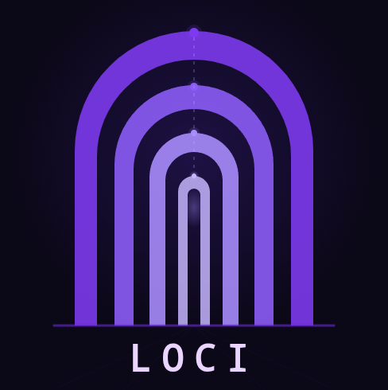

<p align="center">
  
</p>

<h1 align="center">Loci</h1>

<p align="center">
  <i>/ˈloʊ.saɪ/</i> — Cognitive memory for AI agents
</p>

<p align="center">
  Persistent, structured, cross-session memory via MCP.<br/>
  Single binary. Local-first. Zero cloud dependencies.
</p>

<p align="center">
  
  
  
  
</p>

<p align="center">
  <a href="#install">Install</a> · <a href="#quickstart">Quickstart</a> · <a href="docs/architecture.md">Architecture</a> · <a href="docs/cheatsheet.md">Cheatsheet</a> · <a href="docs/why.md">Why Loci?</a>
</p>

---

## The Problem

AI agents forget everything between sessions. Common workarounds — growing markdown files, flat vector stores, conversation logs — treat memories as a uniform blob of text. They lose the structure that matters for retrieval, aging, and relevance.

## The Solution

Loci implements a **four-type memory taxonomy** inspired by cognitive science:

| Type | Stores | Example |
|------|--------|---------|
| **Episodic** | Events, decisions, sessions | *"We deployed v2.3 on Friday"* |
| **Semantic** | Facts, preferences, knowledge | *"User prefers Rust over Go"* |
| **Procedural** | Workflows, patterns, sequences | *"How to run the deploy pipeline"* |
| **Entity** | People, projects, systems | *"Who John Smith is"* |

Each type has different scoping, decay rates, and lifecycle behaviors — episodic memories fade and compact into summaries, semantic knowledge persists and strengthens with use, procedural memories version via supersession, and entities form a relationship graph.

> For a deeper look at the design philosophy, see [Why Loci?](docs/why.md)

---

## Features

- **Hybrid search** — vector similarity (KNN) + keyword (BM25), merged with Reciprocal Rank Fusion
- **Local embeddings** — all-MiniLM-L6-v2 via ONNX Runtime, ~5ms per query, no API key needed
- **Deduplication gate** — near-duplicate memories (cosine > 0.92) are merged, not accumulated
- **Confidence decay** — unused memories fade; accessed memories are reinforced
- **Automatic compaction** — old episodic memories summarize into weekly digests
- **Progressive disclosure** — summary-first retrieval respects token budgets
- **Entity graph** — lightweight triple store for relationships between entities
- **Single file storage** — SQLite + FTS5 + sqlite-vec, all in `~/.loci/memory.db`
- **MCP protocol** — works with Claude Code, Cowork, Agent SDK, and any MCP-compatible client

---

## Install

```bash
cargo install --path .
```

Download the embedding model (~30MB, one-time):

```bash
loci model download
```

---

## Quickstart

### 1. Connect to Claude Code

```bash
claude mcp add loci -- loci serve
```

Or add manually to your `.mcp.json` (project or global `~/.claude/.mcp.json`):

```json
{
  "mcpServers": {
    "loci": {
      "command": "loci",
      "args": ["serve"],
      "env": {
        "LOCI_GROUP": "${workspaceFolder}"
      }
    }
  }
}
```

### 2. Teach your agent to use memory

Add to your `CLAUDE.md`:

```markdown
## Memory

You have access to persistent memory via `loci` MCP tools. Use it proactively.

### When to store:
- User states a preference → store_memory type: semantic
- You learn about a person/project/system → store_memory type: entity
- You learn a multi-step workflow → store_memory type: procedural
- A significant event occurs → store_memory type: episodic

### When to recall:
- At session start: recall_memory(query: "<topic>", summary_only: true)
- Before making assumptions about user preferences
- When the user references something from a past session

### Updating facts (conflict resolution):
When a fact changes (e.g., preference, status, version), supersede the old memory:
1. recall_memory(query: "user theme preference", summary_only: true)
2. store_memory(content: "User prefers light mode", type: "semantic", supersedes: "<old_memory_id>")

Do NOT store contradictory facts side-by-side. Always supersede the outdated one.

### Progressive disclosure:
1. recall_memory(query: "...", summary_only: true, max_results: 10)
2. Scan summaries, identify relevant IDs
3. recall_memory(ids: ["relevant_id_1", "relevant_id_2"])
```

### 3. Verify

```bash
loci stats
loci search "deployment workflow"
```

> For the full setup guide, see [Getting Started](docs/getting-started.md).

---

## MCP Tools

| Tool | Description |
|------|-------------|
| `store_memory` | Store a new memory (with automatic deduplication) |
| `recall_memory` | Hybrid search by query or hydrate by ID |
| `forget_memory` | Soft-delete or hard-delete a memory |
| `memory_stats` | Counts by type, scope, DB size, timestamps |
| `memory_inspect` | Full details: content, metadata, relations, audit log |
| `store_relation` | Link two entity memories with a predicate |

> For full parameter references, see the [Cheatsheet](docs/cheatsheet.md).

---

## CLI

```
loci serve                        Start MCP server (stdio)
loci model download               Pre-download embedding model
loci search <query>               Hybrid search from terminal
loci stats [--group GROUP]        Memory statistics
loci inspect <id>                 Full memory details
loci export > backup.json         Export all memories (JSON)
loci import backup.json           Import memories (re-embeds)
loci compact                      Run maintenance (decay + compact + promote)
loci cleanup [--dry-run]          Preview or delete stale memories
loci reset                        Delete all memories
```

---

## How It Works

```
MCP Client (Claude Code, etc.)
  ↕ stdio (JSON-RPC)
Loci MCP Server
  ├─ 6 MCP Tools
  ├─ Memory Engine
  │   ├─ Write: embed → dedup → store → FTS sync → vec insert → audit
  │   └─ Read:  embed → KNN + BM25 → RRF merge → filter → token budget
  ├─ Maintenance: decay → compact → promote → cleanup
  ├─ Storage: SQLite + FTS5 + sqlite-vec (single file)
  └─ Embeddings: ONNX Runtime + all-MiniLM-L6-v2 (local, 384-dim)
```

> For the full architecture with diagrams, see [Architecture](docs/architecture.md).

---

## Configuration

Optional. Create `~/.loci/config.toml` — all values have sensible defaults:

```toml
[retrieval]
default_max_results = 5
recall_token_budget = 4000
rrf_k = 60
dedup_threshold = 0.92

[maintenance]
episodic_decay_factor = 0.95
semantic_decay_factor = 0.99
compaction_age_days = 30
cleanup_confidence_floor = 0.05
cleanup_no_access_days = 90
```

Environment variable overrides:

| Variable | Overrides |
|----------|-----------|
| `LOCI_DB` | Database path |
| `LOCI_GROUP` | Default memory group |
| `LOCI_LOG_LEVEL` | Log level |

---

## Documentation

| Doc | Description |
|-----|-------------|
| [Why Loci?](docs/why.md) | Design philosophy, trade-offs, and what Loci is not |
| [Getting Started](docs/getting-started.md) | Full setup guide, MCP config, agent instructions, maintenance |
| [Architecture](docs/architecture.md) | System diagrams, storage schema, search pipeline, module map |
| [Cheatsheet](docs/cheatsheet.md) | Quick reference for all tools, CLI commands, and config |

---

## The Name

Named for the *method of loci* — the ancient mnemonic technique where information is stored by associating it with specific locations in a mental palace. Loci builds a structured palace for your AI agents: episodic rooms for what happened, semantic halls for what's known, procedural corridors for how things work, and entity chambers for who and what matters.

---

## License

MIT
