# Architecture

Loci is a single Rust binary (~6k LOC) that serves two roles: an **MCP server** for AI agents and a **CLI** for human operators. Everything runs locally — no cloud services, no Docker, no Node.js.

---

## System Overview

```mermaid
graph TB
    subgraph Clients
        CC[Claude Code]
        CW[Cowork]
        SDK[Agent SDK]
        OTHER[Other MCP Clients]
    end

    subgraph Loci["loci serve"]
        direction TB
        MCP["MCP Tool Interface<br/><i>rmcp · stdio · JSON-RPC</i>"]

        subgraph Tools["6 MCP Tools"]
            SM[store_memory]
            RM[recall_memory]
            FM[forget_memory]
            MS[memory_stats]
            MI[memory_inspect]
            SR[store_relation]
        end

        subgraph Engine["Memory Engine"]
            WP["Write Path<br/><small>embed → dedup → store → FTS → vec → audit</small>"]
            RP["Read Path<br/><small>embed → KNN + BM25 → RRF → filter → budget</small>"]
            MT["Maintenance<br/><small>decay → compact → promote → cleanup</small>"]
        end

        subgraph Storage["SQLite Storage"]
            MEM[(memories)]
            FTS[(memories_fts<br/><i>FTS5 · BM25</i>)]
            VEC[(memories_vec<br/><i>sqlite-vec · 384d</i>)]
            REL[(entity_relations)]
            LOG[(memory_log)]
        end

        EMB["Embedding Engine<br/><i>ONNX Runtime · all-MiniLM-L6-v2</i>"]
    end

    CC & CW & SDK & OTHER -->|"stdin/stdout"| MCP
    MCP --> Tools
    Tools --> Engine
    Engine --> Storage
    Engine --> EMB
```

---

## Memory Taxonomy

Loci classifies memories into four cognitive types, each with different lifecycle behaviors:

```mermaid
graph LR
    subgraph Types["Memory Types"]
        direction TB
        EP["🟡 Episodic<br/><i>'I remember that session'</i>"]
        SE["🔵 Semantic<br/><i>'I know that X is true'</i>"]
        PR["🟢 Procedural<br/><i>'I know how to do X'</i>"]
        EN["🟣 Entity<br/><i>'I know who/what X is'</i>"]
    end

    EP -->|"decays fast<br/>0.95×/cycle"| COMPACT["Compacts into<br/>weekly summaries"]
    COMPACT -->|"repeated patterns"| PROMOTE["Promotes to<br/>semantic"]
    SE -->|"decays slow<br/>0.99×/cycle"| STABLE1["Long-lived<br/>reinforced by access"]
    PR -->|"decays slow<br/>0.99×/cycle"| STABLE2["Stable<br/>versioned via supersession"]
    EN -->|"decays slow<br/>0.99×/cycle"| GRAPH["Relationship graph<br/>via entity_relations"]
```

| Type | Stores | Default Scope | Lifecycle |
|------|--------|---------------|-----------|
| **Episodic** | Events, decisions, interactions | `group` | Decays → compacts into summaries → may promote to semantic |
| **Semantic** | Facts, knowledge, preferences | `global` | Long-lived, reinforced by access |
| **Procedural** | Workflows, patterns, sequences | `global` | Stable, versioned via supersession |
| **Entity** | People, projects, systems | `global` | Stable, relationships tracked in graph |

**Scope** controls visibility:
- `global` — visible across all groups/projects
- `group` — visible only within the originating project context

---

## Storage Layer

Everything lives in a single SQLite database (`~/.loci/memory.db`), using three storage engines:

### SQLite Core
The `memories` table stores content, metadata, confidence scores, access counts, and lifecycle state. UUID v7 primary keys provide time-sortable ordering.

### FTS5 (Full-Text Search)
An external-content FTS5 virtual table (`memories_fts`) enables BM25-ranked keyword search. Kept in sync on write via application logic.

### sqlite-vec (Vector Search)
A `vec0` virtual table (`memories_vec`) stores 384-dimensional float embeddings. Supports KNN queries via `WHERE embedding MATCH ? ORDER BY distance LIMIT N`.

> **Note:** sqlite-vec uses L2 (Euclidean) distance, not cosine similarity. Since all embeddings are L2-normalized to unit vectors, the relationship is: `L2 = √(2 × (1 − cosine_sim))`.

### Entity Relations
A lightweight triple store (`entity_relations`) links entity memories: `(subject_id, predicate, object_id)`. Foreign keys cascade deletes. Deduplicated on the full triple.

### Audit Log
Every mutation (create, update, supersede, decay, compact, delete) is logged in `memory_log` with a JSON details blob.

---

## Embedding Pipeline

The model (~30MB ONNX + tokenizer JSON) downloads on first use to `~/.loci/models/` and is cached. All inference is local — zero network calls during normal operation.

**Thread safety:** The ONNX `Session` is `!Send`, so it's wrapped in a `Mutex` with exclusive access during inference.

---

## Search: Hybrid Retrieval with RRF

Recall uses two parallel search strategies merged with **Reciprocal Rank Fusion**:

```mermaid
graph TB
    Q["Query: 'deployment workflow'"] --> EMB["Embed Query"]
    Q --> TOK["Tokenize for FTS"]

    EMB --> VEC["Vector Search (KNN)<br/><small>memories_vec · L2 distance</small>"]
    TOK --> FTS["Keyword Search (BM25)<br/><small>memories_fts · FTS5</small>"]

    VEC --> |"ranked list A"| RRF["RRF Merge<br/><code>score = Σ 1/(60 + rank)</code>"]
    FTS --> |"ranked list B"| RRF

    RRF --> F1["Filter superseded"]
    F1 --> F2["Apply scope rules<br/><small>global + current group</small>"]
    F2 --> F3["Type & confidence filters"]
    F3 --> F4["Token budget<br/><small>content.len() / 4</small>"]
    F4 --> R["Ranked Results"]
    R --> AT["Track access<br/><small>bump access_count, set last_accessed</small>"]

    style Q fill:#fff3cd,stroke:#333
    style RRF fill:#d4edda,stroke:#333
    style R fill:#e8f4fd,stroke:#333
```

Documents appearing in **both** lists get higher combined scores. The RRF constant `k=60` controls how quickly rank-based scores diminish.

### Progressive Disclosure

To avoid dumping large text payloads into agent context:

---

## Write Path

---

## Maintenance Engine

Four operations for memory lifecycle management, run via `loci compact` and `loci cleanup`:

```mermaid
graph TB
    subgraph Cycle["Maintenance Cycle (loci compact)"]
        direction TB
        DECAY["1. Confidence Decay<br/><small>Episodic: ×0.95 · Others: ×0.99</small>"]
        COMPACT["2. Episodic Compaction<br/><small>Group by (project, week)<br/>5+ members → summary</small>"]
        PROMOTE["3. Promotion<br/><small>3+ similar episodics<br/>→ create semantic memory</small>"]
    end

    subgraph Cleanup["Cleanup (loci cleanup)"]
        STALE["4. Stale Cleanup<br/><small>confidence &lt; 0.05<br/>no access in 90+ days<br/>→ hard delete</small>"]
    end

    DECAY --> COMPACT --> PROMOTE
    STALE -.->|"--dry-run for preview"| STALE

    style DECAY fill:#fff3cd,stroke:#333
    style COMPACT fill:#d4edda,stroke:#333
    style PROMOTE fill:#e8f4fd,stroke:#333
    style STALE fill:#fce4ec,stroke:#333
```

| Operation | Trigger | What Happens |
|-----------|---------|--------------|
| **Decay** | Every cycle | Multiply confidence by per-type factor. Skips superseded memories. |
| **Compaction** | Episodics > 30 days | Group by `(source_group, ISO week)`. 5+ group → concatenate into summary, supersede originals. |
| **Promotion** | 3+ similar episodics | KNN cluster (cosine > 0.88). Create semantic from most-accessed. Does NOT supersede sources. |
| **Cleanup** | On demand | Hard-delete memories with confidence < 0.05 AND no access in 90+ days. |

---

## MCP Protocol

Loci uses the `rmcp` crate (v0.16) for MCP server implementation over stdio transport. The protocol is JSON-RPC over stdin/stdout:

- Tools registered via `#[tool_router]` / `#[tool]` macros
- Parameter schemas derived from structs via `schemars`
- Each tool call spawns blocking work on the tokio runtime

---

## Configuration

TOML config at `~/.loci/config.toml` with five sections:

| Section | Controls |
|---------|----------|
| `[server]` | Transport mode, log level |
| `[storage]` | Database path, default group |
| `[embedding]` | Model provider, cache directory |
| `[retrieval]` | Max results, token budget, RRF k, dedup threshold |
| `[maintenance]` | Decay factors, compaction/promotion/cleanup thresholds |

Environment variable overrides: `LOCI_DB`, `LOCI_GROUP`, `LOCI_LOG_LEVEL`.

---

## Module Map

---

## Key Dependencies

| Crate | Version | Purpose |
|-------|---------|---------|
| `rusqlite` | 0.38 | SQLite with bundled build, vtab support |
| `sqlite-vec` | 0.1 | Vector similarity via SQLite extension |
| `ort` | 2.0.0-rc.11 | ONNX Runtime for local embedding inference |
| `tokenizers` | 0.21 | HuggingFace tokenizer for MiniLM input |
| `rmcp` | 0.16 | MCP server protocol (stdio transport) |
| `uuid` | 1 | UUID v7 (time-sortable) generation |
| `tokio` | 1 | Async runtime |
| `clap` | 4 | CLI argument parsing (derive API) |
| `tracing` | 0.1 | Structured logging |
| `schemars` | 1.x | JSON Schema generation for tool params |
| `anyhow` | 1 | Error handling |
| `serde` / `serde_json` | 1 | Serialization |
