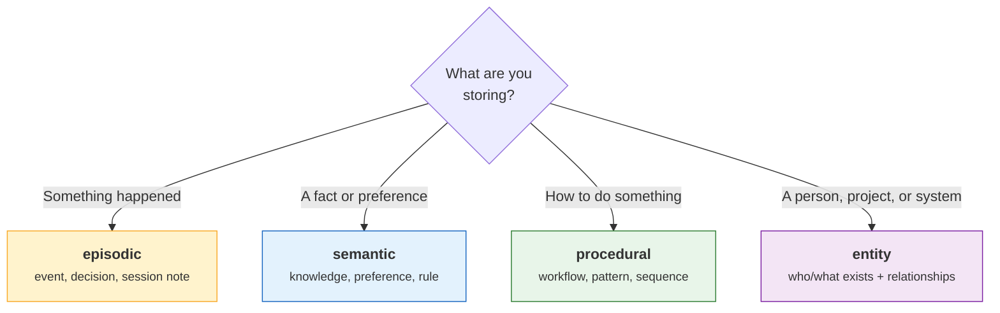
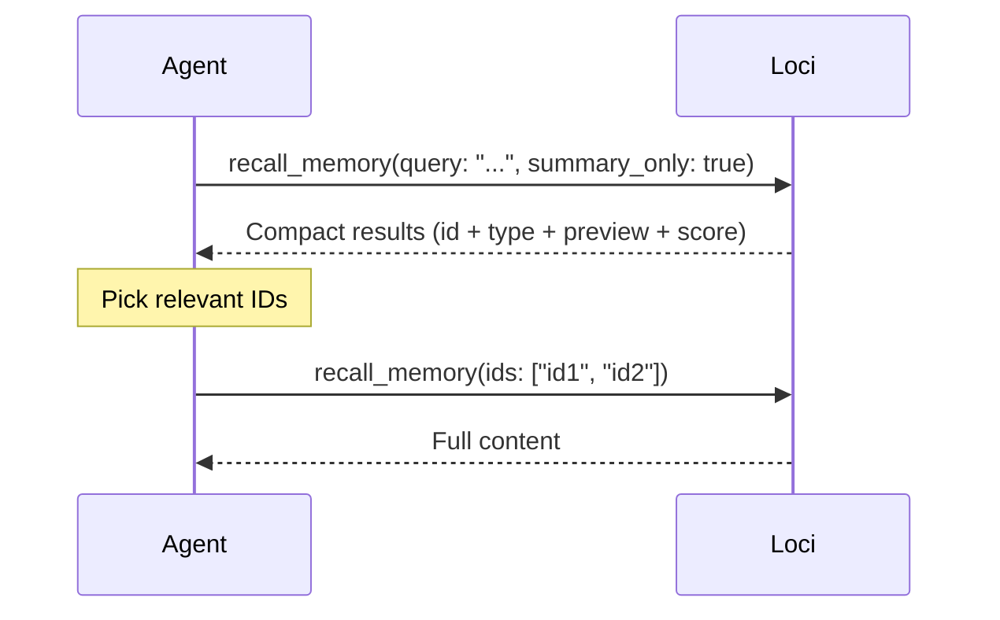

# Cheatsheet

Quick reference for all Loci MCP tools, CLI commands, and configuration.

---

## Which Memory Type?



| Type | Use When | Default Scope | Decay Rate |
|------|----------|---------------|------------|
| `episodic` | Something happened | `group` | 0.95×/cycle, compacts after 30d |
| `semantic` | A fact is known | `global` | 0.99×/cycle, stable |
| `procedural` | A process is learned | `global` | 0.99×/cycle, stable |
| `entity` | A person/thing exists | `global` | 0.99×/cycle, has relations |

---

## MCP Tools

### store_memory

Store a new memory or update an existing near-duplicate.

```json
{
  "content": "User prefers Rust over Go for systems work",
  "type": "semantic",
  "scope": "global",
  "metadata": { "category": "preference" }
}
```

| Param | Type | Required | Default | Notes |
|-------|------|----------|---------|-------|
| `content` | string | yes | | The memory text |
| `type` | string | yes | | `episodic` `semantic` `procedural` `entity` |
| `scope` | string | no | by type | `global` or `group` |
| `group` | string | no | env/config | Project context |
| `metadata` | object | no | `{}` | Arbitrary JSON |
| `supersedes` | string | no | | ID of memory this replaces |
| `confidence` | float | no | 1.0 | 0.0–1.0 |

> **Dedup:** If content is >0.92 cosine similar to an existing same-type memory, the existing one is updated (confidence boosted, timestamp bumped) instead of creating a duplicate.

---

### recall_memory

Search by query or hydrate by IDs.

**Search mode:**
```json
{ "query": "deployment workflow", "summary_only": true, "max_results": 10 }
```

**Hydration mode:**
```json
{ "ids": ["01953a2b-...", "01953a2c-..."] }
```

| Param | Type | Required | Default | Notes |
|-------|------|----------|---------|-------|
| `query` | string | if no `ids` | | Natural language search |
| `ids` | string[] | if no `query` | | Direct hydration by ID |
| `type` | string | no | | Filter by memory type |
| `scope` | string | no | | Filter: `global` / `group` |
| `group` | string | no | env/config | Group for scope filtering |
| `max_results` | int | no | 5 | Range: 1–20 |
| `summary_only` | bool | no | false | Compact index mode |
| `token_budget` | int | no | 4000 | Max estimated tokens |
| `min_confidence` | float | no | 0.1 | Floor filter |

**Recommended two-step pattern:**



---

### forget_memory

Soft-delete (default) or hard-delete a memory.

```json
{ "memory_id": "01953a2b-...", "reason": "outdated info" }
```

| Param | Type | Required | Default | Notes |
|-------|------|----------|---------|-------|
| `memory_id` | string | yes | | Target memory |
| `reason` | string | no | | Why it's being forgotten |
| `hard_delete` | bool | no | false | Permanent removal from all tables |

---

### memory_stats

```json
{}
```

Returns: counts by type, scope, relation count, db size, oldest/newest timestamps.

Optional `group` param filters to a specific project.

---

### memory_inspect

```json
{ "memory_id": "01953a2b-...", "include_relations": true, "include_log": true }
```

Returns: full content, metadata, confidence, access history, relations, and audit log.

---

### store_relation

Link two entity memories.

```json
{
  "subject_id": "01953a2b-...",
  "predicate": "works_at",
  "object_id": "01953a2c-..."
}
```

Both IDs must reference entity-type memories. Deduplicated on the full triple.

**Common predicates:** `works_at`, `manages`, `part_of`, `related_to`, `depends_on`, `created_by`, `owns`

---

## CLI Commands

```bash
# Server
loci serve                          # Start MCP server (stdio)

# Model
loci model download                 # Pre-download embedding model

# Search
loci search "rust async patterns"   # Hybrid search from terminal

# Inspect
loci stats                          # Global stats
loci stats --group my-project       # Group-filtered stats
loci inspect <memory-id>            # Full details for one memory

# Data management
loci export > backup.json           # Export (no embeddings)
loci import backup.json             # Import (re-embeds)
loci reset                          # Delete everything (confirms)

# Maintenance
loci compact                        # Decay + compact + promote
loci cleanup --dry-run              # Preview stale candidates
loci cleanup                        # Hard-delete stale memories
```

---

## Metadata Examples

**Episodic:**
```json
{ "event_date": "2026-02-22", "session_id": "sess_abc123", "summary": true }
```

**Semantic:**
```json
{ "category": "preference", "subject": "programming_language" }
```

**Procedural:**
```json
{ "trigger": "deployment", "steps": ["test", "build", "deploy"], "version": 2 }
```

**Entity:**
```json
{ "entity_type": "person", "name": "John Smith", "aliases": ["John", "JS"] }
```

---

## Configuration Defaults

```toml
[retrieval]
default_max_results = 5        # Results per recall
recall_token_budget = 4000     # Max tokens in response
rrf_k = 60                     # RRF merge constant
dedup_threshold = 0.92         # Cosine sim for dedup gate

[maintenance]
episodic_decay_factor = 0.95   # Per-cycle episodic decay
semantic_decay_factor = 0.99   # Per-cycle semantic/procedural/entity decay
compaction_age_days = 30       # Compact episodics older than this
compaction_min_group_size = 5  # Min group size to trigger compaction
promotion_threshold = 3        # Similar episodics needed for promotion
promotion_similarity = 0.88    # Cosine sim for promotion clustering
cleanup_confidence_floor = 0.05 # Below this = cleanup candidate
cleanup_no_access_days = 90    # Days without access before eligible
```

---

## Environment Variables

```bash
LOCI_DB=/path/to/memory.db     # Override database path
LOCI_GROUP=my-project           # Override default group
LOCI_LOG_LEVEL=debug            # Override log level
```

---

## File Locations

```
~/.loci/
  config.toml      # Configuration (optional)
  memory.db        # SQLite database
  models/
    model.onnx     # Embedding model (~30MB)
    tokenizer.json # HuggingFace tokenizer
```
