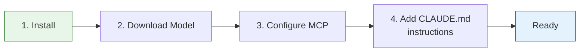
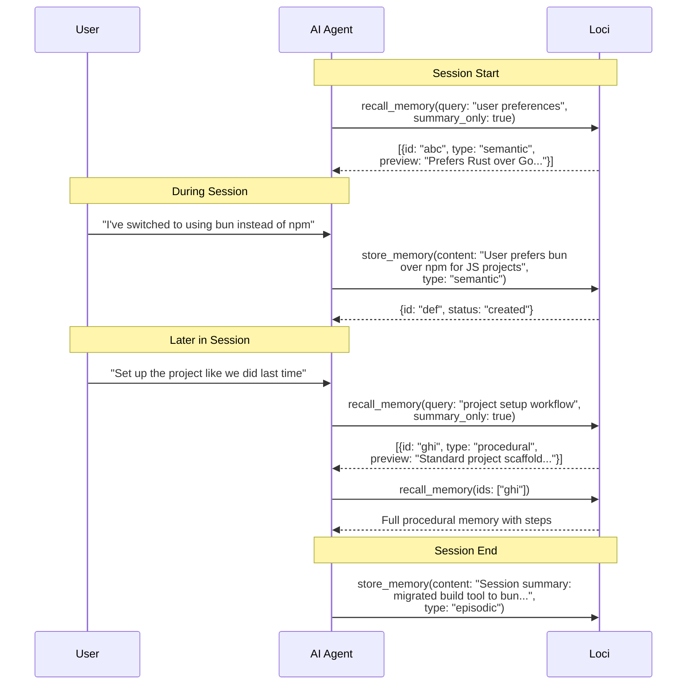
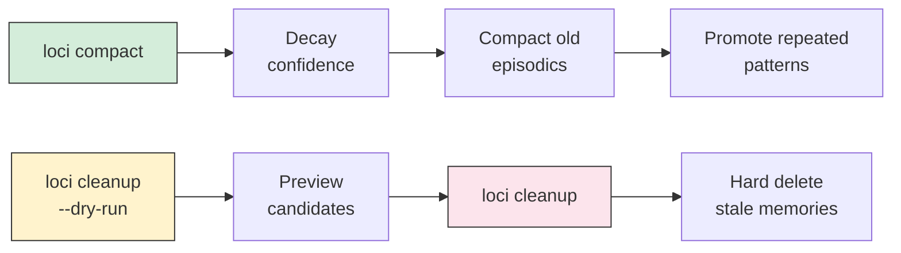

# Getting Started

## Quick Setup



---

## 1. Install

```bash
cargo install --path .
```

This builds a single `loci` binary. No runtime dependencies.

## 2. Download the Embedding Model

```bash
loci model download
```

Downloads all-MiniLM-L6-v2 (~30MB ONNX model + tokenizer) to `~/.loci/models/`. This happens automatically on first use, but pre-downloading avoids the initial delay.

## 3. Connect to Claude Code

Add to your `.mcp.json` (project-level or global `~/.claude/.mcp.json`):

```json
{
  "mcpServers": {
    "loci": {
      "command": "loci",
      "args": ["serve"],
      "env": {
        "LOCI_GROUP": "${workspaceFolder}"
      }
    }
  }
}
```

> `LOCI_GROUP` scopes episodic memories to the current project. Global memories (semantic, procedural, entity) are visible everywhere.

## 4. Teach Your Agent to Use Memory

Add this to your project's `CLAUDE.md` (or global `~/.claude/CLAUDE.md`):

```markdown
## Memory

You have access to a persistent memory system via `loci` MCP tools.
Use it proactively throughout every session.

### When to store memories:
- User states a preference -> store_memory type: semantic
- You learn about a person, project, or system -> store_memory type: entity
- You learn or execute a multi-step workflow -> store_memory type: procedural
- A significant decision is made or event occurs -> store_memory type: episodic

### When to recall memories:
- At session start: recall_memory(query: "<topic>", summary_only: true)
- Before making assumptions about user preferences
- When the user references something from a past session

### Progressive disclosure:
1. recall_memory(query: "...", summary_only: true, max_results: 10)
2. Scan summaries, identify relevant IDs
3. recall_memory(ids: ["relevant_id_1", "relevant_id_2"])

### Session exit:
Before ending a significant session:
store_memory(content: "Session summary: ...", type: "episodic")

### Entity relationships:
When you identify relationships between entities:
store_relation(subject_id: "person_id", predicate: "works_at", object_id: "company_id")
```

---

## Verify It Works

```bash
# Start the server manually (blocks on stdin — that's normal)
loci serve

# Check stats from the CLI
loci stats

# Search your memories
loci search "deployment workflow"
```

---

## How It Works in Practice



---

## CLI Commands

| Command | Description |
|---------|-------------|
| `loci serve` | Start MCP server (stdio transport) |
| `loci model download` | Pre-download the embedding model |
| `loci search <query>` | Search memories from terminal |
| `loci stats [--group GROUP]` | Memory statistics |
| `loci inspect <id>` | Full memory details |
| `loci export` | Export all memories as JSON |
| `loci import <file>` | Import memories from JSON |
| `loci compact` | Run maintenance (decay + compact + promote) |
| `loci cleanup [--dry-run]` | Preview or delete stale memories |
| `loci reset` | Delete all memories (requires confirmation) |

---

## Configuration

Create `~/.loci/config.toml` (optional — all values have sensible defaults):

```toml
[server]
transport = "stdio"
log_level = "info"

[storage]
db_path = "~/.loci/memory.db"
default_group = "default"

[embedding]
provider = "local"
model = "all-MiniLM-L6-v2"
cache_dir = "~/.loci/models"

[retrieval]
default_max_results = 5
recall_token_budget = 4000
rrf_k = 60
dedup_threshold = 0.92

[maintenance]
episodic_decay_factor = 0.95
semantic_decay_factor = 0.99
compaction_age_days = 30
cleanup_confidence_floor = 0.05
cleanup_no_access_days = 90
```

### Environment Variable Overrides

| Variable | Overrides | Example |
|----------|-----------|---------|
| `LOCI_DB` | `storage.db_path` | `LOCI_DB=/tmp/test.db loci serve` |
| `LOCI_GROUP` | `storage.default_group` | `LOCI_GROUP=my-project loci serve` |
| `LOCI_LOG_LEVEL` | `server.log_level` | `LOCI_LOG_LEVEL=debug loci serve` |

---

## Maintenance

Run periodically to keep the memory store healthy:

```bash
# Full maintenance cycle: decay confidence, compact old episodics, promote to semantic
loci compact

# Preview what would be cleaned up
loci cleanup --dry-run

# Actually delete stale memories (confidence < 0.05, no access in 90+ days)
loci cleanup
```



---

## File Locations

| Path | Contents |
|------|----------|
| `~/.loci/config.toml` | Configuration (optional) |
| `~/.loci/memory.db` | SQLite database (all memories) |
| `~/.loci/models/` | Cached ONNX model + tokenizer |

## Backup and Restore

```bash
# Export all memories (no embeddings — they're re-generated on import)
loci export > backup.json

# Import into a fresh database
loci import backup.json

# Or just copy the SQLite file
cp ~/.loci/memory.db ~/backups/memory.db.bak
```
