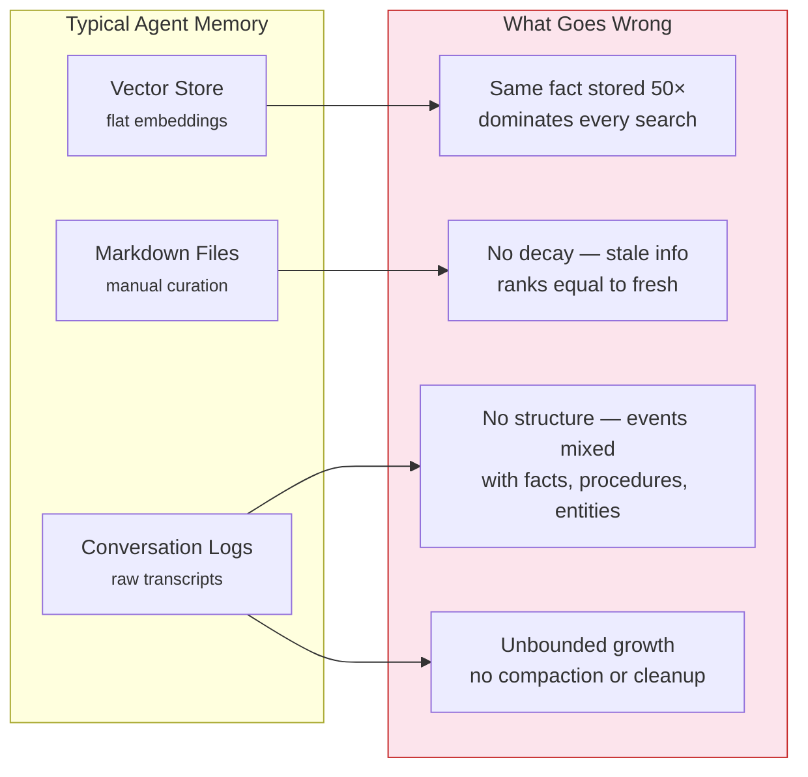
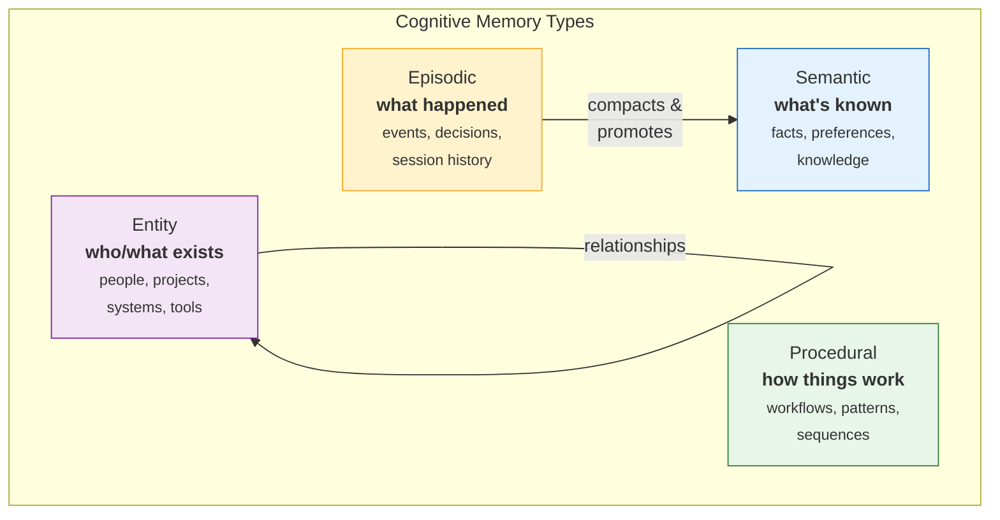
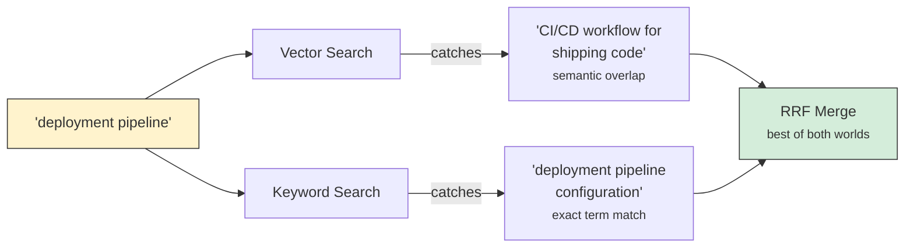
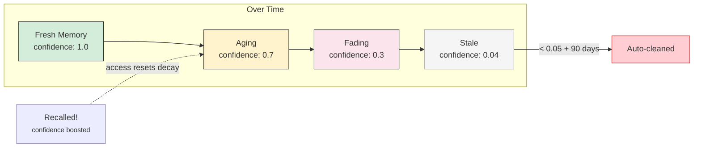

# Why Loci

## The Problem

AI agents forget everything between sessions. Every conversation starts from zero.

The common workarounds — growing markdown files, flat vector stores, conversation logs — all treat memories as a **uniform blob of text**. They lose the structure that matters for retrieval, aging, and relevance.

Real memory isn't uniform. Knowing *"we deployed on Friday"* (an event) is different from knowing *"the user prefers Rust"* (a fact) is different from knowing *"how to run the deploy pipeline"* (a procedure) is different from knowing *"who John Smith is"* (an entity). Lumping them together means you can't decay events differently from facts, can't compact old sessions into summaries, can't promote repeated observations into durable knowledge.

---

## The Approach

Loci implements a **four-type memory taxonomy** inspired by cognitive science:

Each type has different default scope, lifecycle behavior, and aging characteristics:

- **Episodic** memories decay and compact — specific events fade into weekly summaries
- **Semantic** memories are stable and reinforced by use — the more you recall a fact, the stronger it gets
- **Procedural** memories are versioned — new workflows supersede old ones
- **Entity** memories form a relationship graph — people, projects, and systems are linked

---

## Design Decisions

### Single binary, local-first

No Docker. No Node.js runtime. No cloud service. `cargo install loci` and you're running. The ONNX embedding model downloads once on first use (~30MB). After that, **zero network calls** during normal operation. Your memories stay on your machine.

### SQLite, not a vector database

Loci uses SQLite for everything: relational storage, full-text search (FTS5), and vector similarity (sqlite-vec). **One file, one process, no server.** SQLite's reliability and portability are unmatched for a single-user local tool. Running Qdrant or Chroma alongside adds operational complexity for marginal benefit at this scale.

### Hybrid search, not just vectors

Pure vector search misses exact keyword matches. Pure keyword search misses semantic similarity. Loci runs both and merges results with **Reciprocal Rank Fusion (RRF)**.

### Local embeddings, not API calls

The all-MiniLM-L6-v2 model (384-dim, ~30MB ONNX) runs locally via ONNX Runtime. Embedding a query takes ~5ms on modern hardware. No API key. No network latency. No per-token cost. No data leaving your machine.

### MCP protocol, not a custom API

Loci is an MCP (Model Context Protocol) server. Any MCP-compatible client — Claude Code, Cowork, custom Agent SDK agents — can connect via `.mcp.json`. The protocol is standardized, so **memory survives tool changes**. Switch agents, keep your memories.

### Progressive disclosure, not context dumping

Never dump all memories into agent context. Loci supports a two-step workflow: first retrieve compact summaries, then hydrate only the relevant ones by ID. This respects token budgets and keeps context focused.

### Deduplication, not accumulation

Before storing any memory, Loci checks existing memories of the same type for cosine similarity > 0.92. Near-duplicates get merged — the existing memory's confidence is boosted and its timestamp updated. This prevents the common failure mode where the same fact stored 50 times dominates every search result.

### Confidence decay, not manual pruning

Memories that are never accessed gradually lose relevance. Episodic memories decay faster (0.95×/cycle) than semantic ones (0.99×). Recalled memories get boosted. Over time, the store **self-curates**: useful memories rise, stale ones sink below the cleanup threshold.

### Compaction, not unbounded growth

Old episodic memories (30+ days) are grouped by week and project, concatenated into summaries, and the originals superseded. Repeated episodic observations (3+ similar memories) can be promoted to semantic facts. This mirrors how human memory works: **specific events fade, but patterns and knowledge persist.**

---

## What Loci Is Not

| | |
|---|---|
| **Not a knowledge graph database** | The entity relations table is a lightweight triple store, not Neo4j. Graph traversal is one hop. |
| **Not a conversation logger** | Loci stores structured memories that the agent explicitly decides to save, not raw transcripts. |
| **Not a shared/team memory system** | Personal memory for a single user's AI agents. Multi-user collaboration is a different problem. |
| **Not a model training tool** | Memory is for retrieval only. It doesn't adapt or fine-tune any model. |

---

## The Name

Named for the *method of loci* (memory palace technique) — the ancient mnemonic system where information is stored by associating it with specific locations in a mental space.

Loci builds a structured palace for your AI agents:
- **Episodic rooms** for what happened
- **Semantic halls** for what's known
- **Procedural corridors** for how things work
- **Entity chambers** for who and what matters
